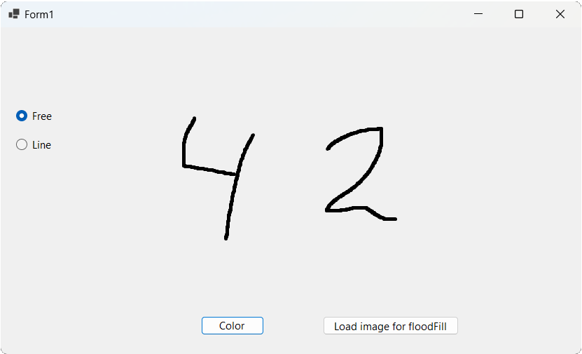
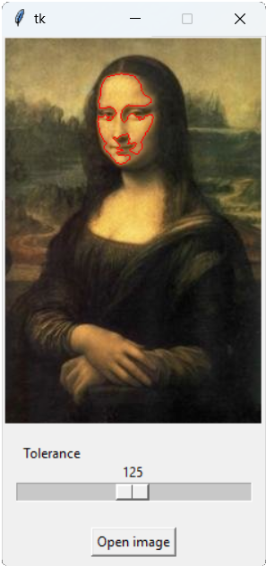

# Лабораторная работа №3. Растровые алгоритмы
## Задание
Задание 1. Заливка и выделение границы.

1. Задание 1
    - Рекурсивный алгоритм заливки на основе серий пикселов (линий)  заданным цветом.

    - Рекурсивный алгоритм заливки на основе серий пикселов (линий)  рисунком из графического файла. Файл можно загрузить встроенными средствами и затем считывать точки изображения для использования в заливке. Рассмотреть случаи когда файл небольшого размера и заливается циклически и когда большой. Масштабировать не нужно.  Область рисуется мышкой. Область произвольной формы. Внутри могут быть отверстия. Точка, с которой начинается заливка, задается щелчком мыши.

    - Выделение границы связной области. На вход подается изображение. Граница связной области задается одним цветом. Имея начальную точку границы организовать ее обход, занося точки в список в порядке обхода. Начальную точку границы можно получать любым способом. Для контроля полученную границу прорисовать поверх исходного изображения.
2. Реализовать рисование отрезка: целочисленным алгоритмом Брезенхема  и алгоритмом ВУ.
3. Выполнить градиентное окрашивание произвольного треугольника, у которого все три вершины разного цвета, используя алгоритм растеризации треугольника.

## Демонстрация работы

